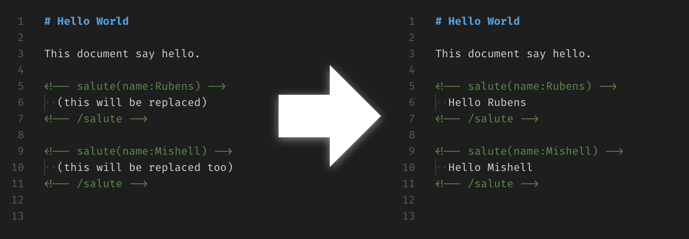

<div align=center>
  <h1>XML Comment API</h1>
  <p>Parse XML comment that provide an API</p>
  
</div>

## Installation

```shell
npm install xml-comment-api
```

## Usage

```js
const XmlCommentApi = require('xml-comment-api')

const input = `
  # Hello World
  <!-- salute(name:Rubens) --> <!-- /salute -->
`

XmlCommentApi(input).replace('salute', (tag) => `Hi ${tag.attributes.name}`)
// > # Hello World
//   <!-- salute(name:Rubens) -->Hi Rubens<!-- /salute -->
```

## API

Everything starts by invoking the `XmlCommentApi` function passing the string containgin XML comments.

```js
const XmlCommentApi = require('xml-comment-api')
XmlCommentApi('<!-- tag-name --> <!-- /tag-name -->')
```

When `XmlCommentApi` is invoked it will return an object exposing a few methods:

### `find(name: String, options: Object) : Array`

Find all tags by `name`. The `name` by default is case sensitive. The second parameter are `options`.

```js
XmlCommentApi('<!-- salute -->😘<!-- /salute -->')
  .find('salute')

// >  [{
//      tag: 'salute', 
//      attributes: undefined,
//      contents: '😘',
//      start: 15,
//      end: 17
//    }]
```

### `replace(name: String, options: Object, callback: Function|String) : XmlCommentApiObject`

Find all tags by `name` using `options` and replace the contents of matching tags with the result of the `callback` (when a `Function` is given) or with the `callback` itself (when a `String` is given).

```js
XmlCommentApi('<!-- salute -->😘<!-- /salute -->')
  .replace('salute', '❤️')
  .contents()

// >  <!-- salute -->❤️<!-- /salute -->
```

### `contents() : String`

Return the modified string. Useful when using `replace` to obtain the modified string.

#### License

[MIT](LICENSE)
